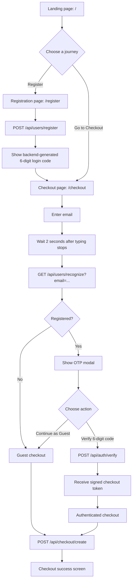

# QuickCheckout

QuickCheckout is a Next.js and Django checkout application that recognizes registered users by email, verifies them using a six-digit login code, and still supports an uninterrupted guest checkout experience.

The interface uses a universe-black visual theme with blue primary actions and orange highlights.

## Application flow



## User journeys

### New user registration

1. Open `/register`.
2. Enter a valid email, first name, and last name.
3. The frontend submits the exact snake_case registration payload.
4. Django creates the account, generates a six-digit code, stores only its bcrypt hash, and returns the plain code once.
5. The frontend displays the returned code and provides navigation to checkout.

### Returning user checkout

1. Open `/checkout` and enter an email address.
2. Email recognition begins only after the value has been stable for **2 seconds**.
3. If the account exists, the OTP modal opens.
4. Enter the six-digit code and select **Verify Code**.
5. Django validates the bcrypt hash and returns a short-lived signed checkout token.
6. The frontend sends that token as a Bearer authorization header with the checkout request.
7. Django validates the token and saves the checkout linked to that user; the response has a non-null `user_id`.

### Guest checkout

A user can remain a guest in either of these cases:

- The email is not registered.
- A registered user selects **Continue as Guest** in the OTP modal.

Guest checkout sends the normal checkout payload without an authorization header. Django saves the checkout with `user_id: null`.

## Frontend routes

| Route | Purpose |
| --- | --- |
| `/` | Landing page and product overview |
| `/register` | New-user registration and login-code success state |
| `/checkout` | Email recognition, OTP verification, guest checkout, and checkout success |
| `/popup-module` | Visual OTP popup preview over the checkout interface |

## API contract

| Feature | Method | Endpoint | Request |
| --- | --- | --- |
| Register | `POST` | `/api/users/register` | `{ "email", "first_name", "last_name" }` |
| Recognize email | `GET` | `/api/users/recognize?email=<email>` | No body |
| Verify login code | `POST` | `/api/auth/verify` | `{ "email", "code" }` |
| Create checkout | `POST` | `/api/checkout/create` | `{ "email", "phone", "shipping_address" }` |

### Checkout request examples

Guest checkout:

```http
POST /api/checkout/create
Content-Type: application/json

{
  "email": "guest@example.com",
  "phone": "8965390841",
  "shipping_address": "13 Main Street"
}
```

Authenticated checkout uses the same JSON payload and adds the token returned by OTP verification:

```http
Authorization: Bearer <checkout_auth_token>
```

## Security and reliability

- Login codes are bcrypt-hashed in the database; their plain value is returned only immediately after registration.
- The checkout authentication token is cryptographically signed by Django and expires after 15 minutes by default (`CHECKOUT_AUTH_TOKEN_MAX_AGE`).
- Changing the checkout email clears the current authenticated token.
- Recognition requests are debounced for two seconds and aborted when a newer email value supersedes them, avoiding stale modal results.
- Registration, OTP verification, and checkout show loading/error states and prevent duplicate button actions.
- CORS is restricted through `CORS_ALLOWED_ORIGINS`, which defaults to the local Next.js origins.

## Local setup

### Backend

1. Create `backend/.env` from `backend/.env.example` and provide Django/database values.
2. Install dependencies:

   ```powershell
   .\backend\venv\Scripts\python.exe -m pip install -r .\backend\requirements.txt
   ```

3. Apply migrations and run the server:

   ```powershell
   .\backend\venv\Scripts\python.exe .\backend\manage.py migrate
   .\backend\venv\Scripts\python.exe .\backend\manage.py runserver
   ```

The backend runs at `http://127.0.0.1:8000` by default.

### Frontend

1. Install frontend dependencies:

   ```powershell
   cd frontend
   npm install
   ```

2. Optionally set `NEXT_PUBLIC_API_BASE_URL` in `frontend/.env.local`. It defaults to `http://127.0.0.1:8000`.
3. Start Next.js:

   ```powershell
   npm exec next dev
   ```

Open `http://localhost:3000` in a browser.

## Project structure

```text
BOLT/
├── backend/
│   ├── users/                 # Registration, recognition, OTP verification
│   ├── checkout/              # Guest/authenticated checkout persistence
│   ├── config/                # Django settings, CORS, signed-token lifetime
│   └── requirements.txt
├── frontend/
│   ├── app/                   # Next.js routes and shared styles
│   ├── components/            # Reusable UI components
│   ├── services/              # Axios API clients
│   └── hooks/useDebounce.ts   # Two-second email recognition debounce
├── prompt.md                  # Backend prompt history
└── frontend-prompt.md         # Frontend prompt history
```
